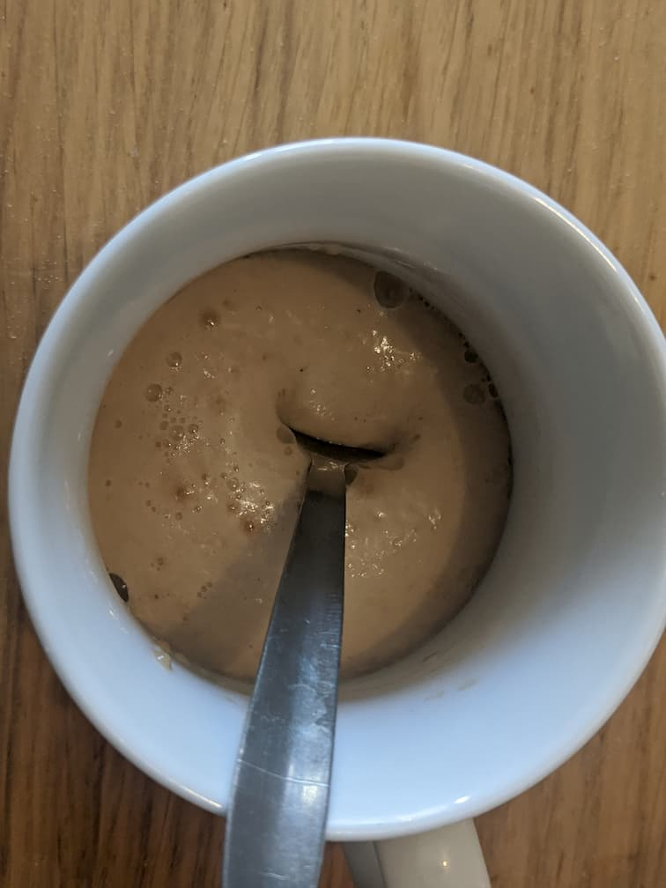
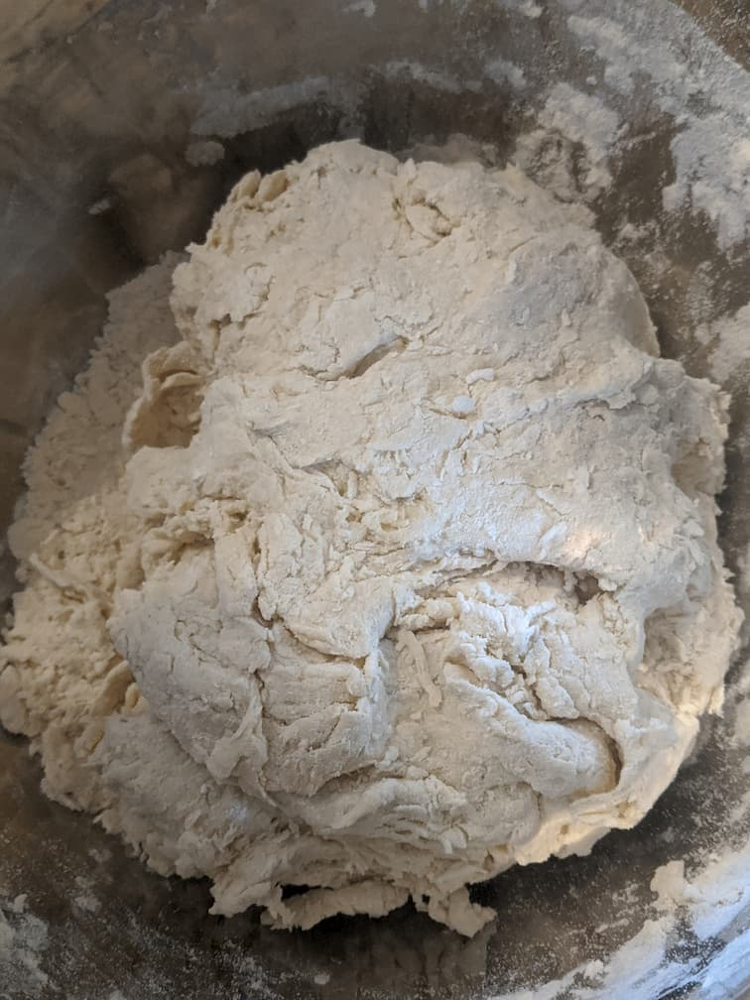
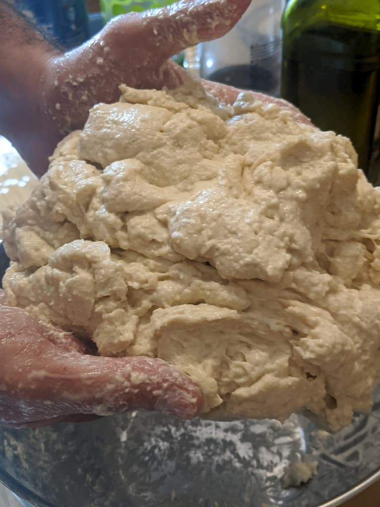
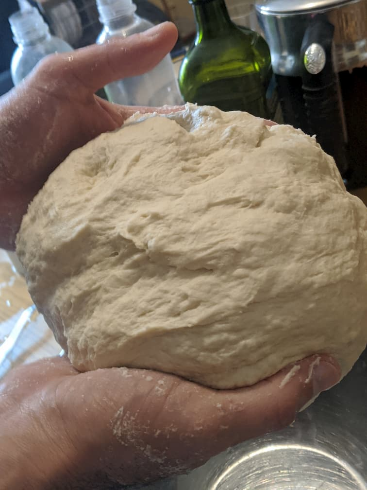
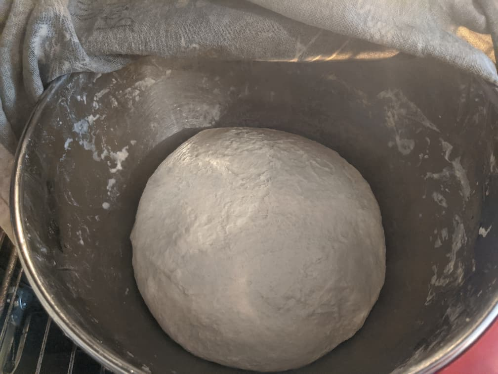
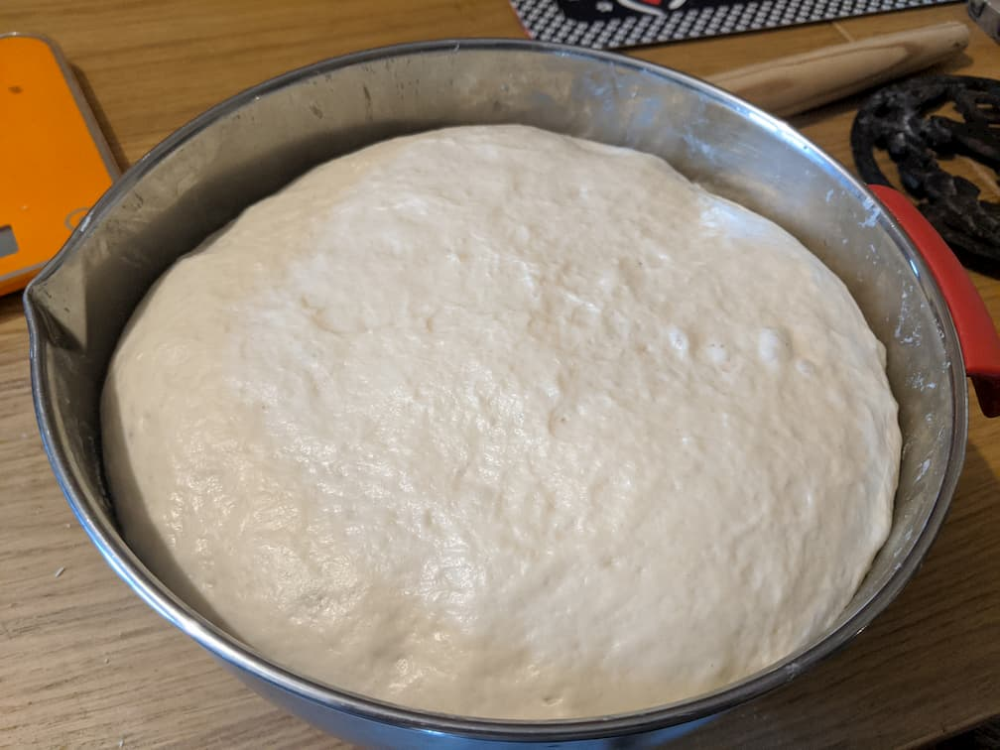
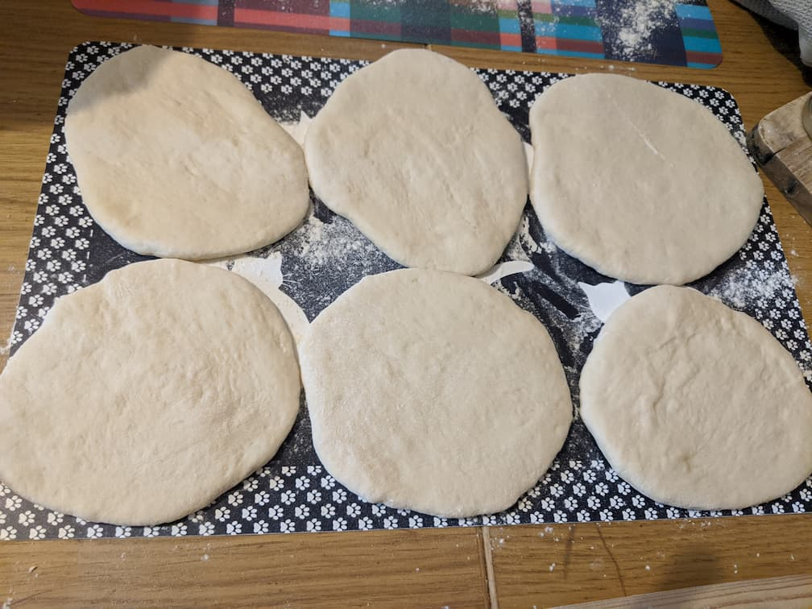
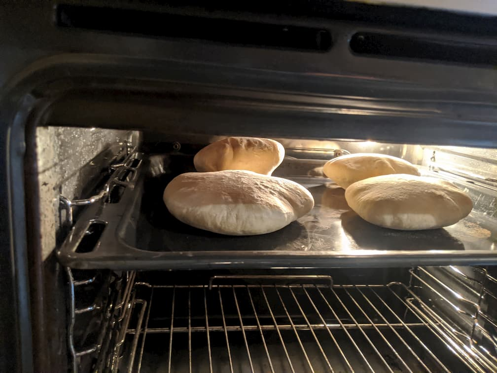
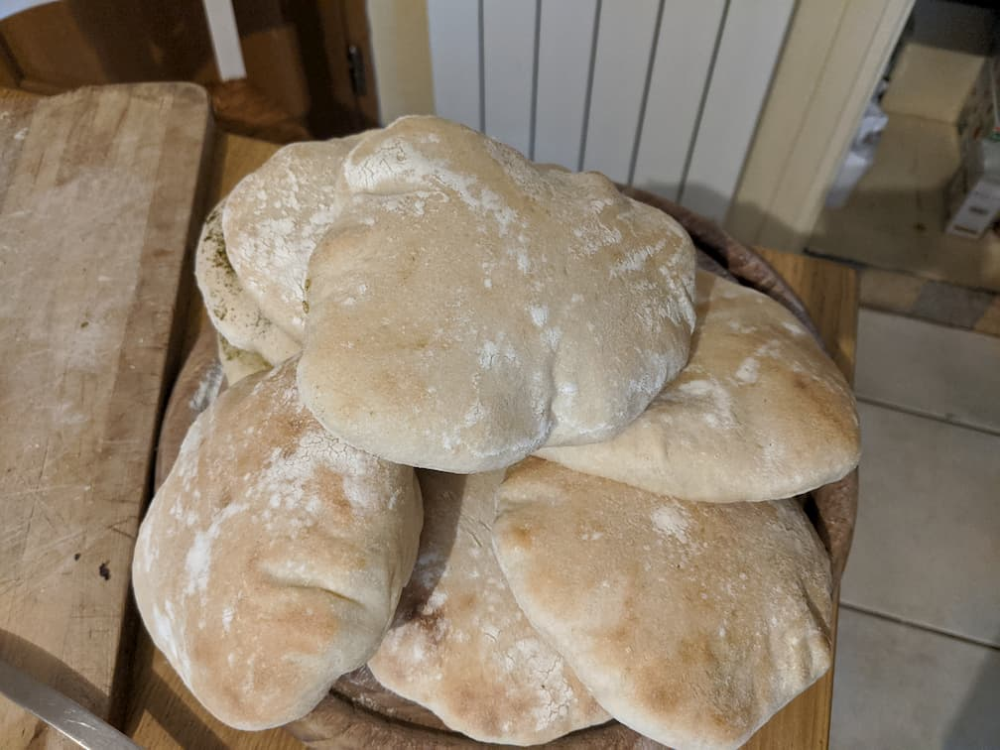

# Pitas

## Ingredients

* 5g of dried yeast or 20g of fresh yeast
* 1 tablespoon of brown sugar
* 1 tablespoon of salt
* 2 tablespoons of olive oil.
* 1 kg of flour (and a bit more flour to work the dough)
* ~620-680ml of lukewarm water (~40°C)

## Processing model

### Preparing the dough

1. Take the yeast, the tablespoon of sugar and a bit of water and mix them together in a glass. Give the yeast ~10 minutes to react & foam.

<picture>
  <source srcset="images/pita/yeast.webp" type="image/webp">
  
</picture>

2. Put the flour in a large bowl, add the yeast, and start adding water little by little, while kneading everything to a dough.

3. Once the ball of dough is a bit formed, dissipate the tablespoon of salt in some water and add it to the mix. Continue kneading.

<picture>
  <source srcset="images/pita/ready_for_salt.webp" type="image/webp">
  
</picture>

4. Add 2 tablespoons of olive oil to the mix and continue kneading. Add in more water as you go.

5. At some point, the mix feels too wet and you may think you got it wrong. Fear not!! Keep kneading until the mixture is smooth. Add more water as needed, once the mixture have dried out a bit.

<picture>
  <source srcset="images/pita/moist.webp" type="image/webp">
  
</picture>

6. Once the ball of dough is smooth, firm and a bit sticky, you're almost done!

<picture>
  <source srcset="images/pita/dough_almost_done.webp" type="image/webp">
  
</picture>

7. Cover the bowl with the ball of dough in it with a wet cloth, and place it in a luke warm place for a couple of hours.

<picture>
  <source srcset="images/pita/dough_is_done.webp" type="image/webp">
  
</picture>

### Pitas!

1. After a couple of hours, the dough has risen.

<picture>
  <source srcset="images/pita/dough_risen.webp" type="image/webp">
  
</picture>

2. Preheat your oven to 250°C, with a steel oven tray in it, placed in the upper part.

2. While there's dough in the bowl:

    1. Cut a fistful of dough and turn it into a ball.

    2. Flatten the ball using a rolling pin, until it's about ~0.5cm thick.

    3. Place it on a floured surface and let it rise for ~10 minutes.

<picture>
  <source srcset="images/pita/dough_as_pitas.webp" type="image/webp">
  
</picture>

3. Once the oven is done preheating, switch it to grill mode.

4. Throw the pita bread in the oven, ~4 at a time, for ~5 minutes

<a target="_blank" href="https://www.youtube.com/watch?v=t6BVLbGUPj8">Video</a>

5. You can take them out once they develop a slightly brown hue and an air pocket.

<picture>
  <source srcset="images/pita/pitas_in_oven.webp" type="image/webp">
  
</picture>

6. Eat up!!

<picture>
  <source srcset="images/pita/all_done.webp" type="image/webp">
  
</picture>

